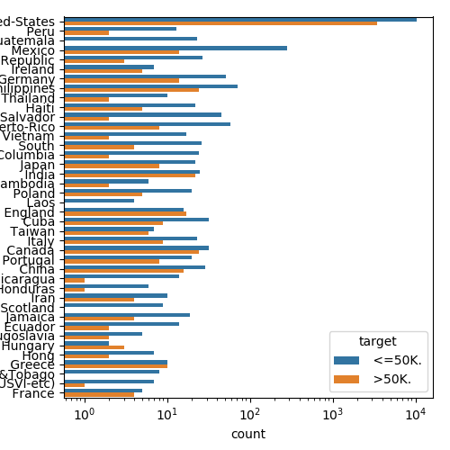
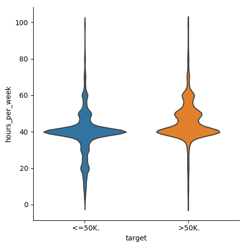
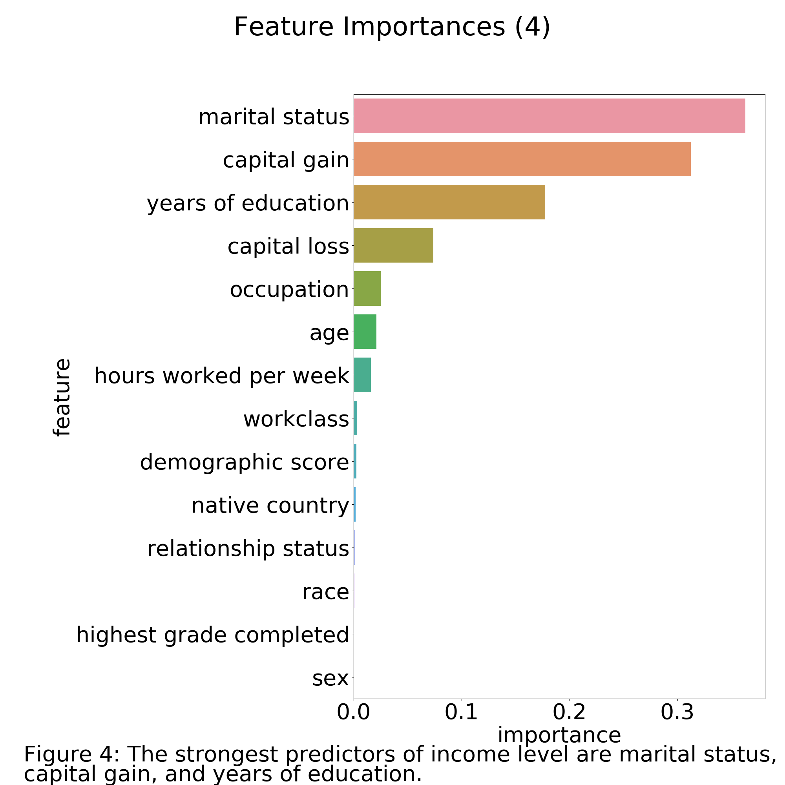

Income level predictors among US Adults
================

Problem Statement:
------------------

The income levels across the US are influenced by various factors based on geography, societal and political. The US census has attributed the drivers for income level across the country to features like race, nativity, education , profession etc. The presence of prevalent inequity in income distribution is a valid motivation to find the factors that influence them.

We are interested in the strongest predictors of income level of US adults.

<<<<<<< HEAD
Dataset Overview
----------------
=======
Dataset
-------
>>>>>>> upstream/master

The dataset includes various demographic and employment details of a sample of US adults. In the dataset, there are records missing occupation field, native country, and if an adult was working in the private or public sector. These records, which made up about 7% of the total records, were ignored during analysis.

For the categorical features, we replaced the string values with dummy variables. These features are: workclass, education, marital status, occupation, relationship status, sex, native country, and race.

<<<<<<< HEAD
### Features Description

-   workclass: Private, Self-emp-not-inc, Self-emp-inc, Federal-gov, Local-gov, State-gov, Withoutpay, Never-worked. 69.4% values are Private
-   education: Bachelors, Some-college, 11th, HS-grad, Prof-school, Assoc-acdm, Assoc-voc, 9th, 7th8th, 12th, Masters, 1st-4th, 10th, Doctorate, 5th-6th, Preschool
-   marital-status: Married-civ-spouse, Divorced, Never-married, Separated, Widowed, Marriedspouse-absent, Married-AF-spouse
-   occupation: Tech-support, Craft-repair, Other-service, Sales, Exec-managerial, Prof-specialty, Handlers-cleaners, Machine-op-inspct, Adm-clerical, Farming-fishing, Transport-moving, Privhouse-serv, Protective-serv, Armed-Forces
-   relationship: Wife, Own-child, Husband, Not-in-family, Other-relative, Unmarried
-   race: White, Asian-Pac-Islander, Amer-Indian-Eskimo, Other, Black
-   sex: Female, Male
-   native-country: United-States, Cambodia, England, Puerto-Rico, Canada, Germany, OutlyingUS(Guam-USVI-etc), India, Japan, Greece, South, China, Cuba, Iran, Honduras, Philippines, Italy, Poland, Jamaica, Vietnam, Mexico, Portugal, Ireland, France, Dominican-Republic, Laos, Ecuador, Taiwan, Haiti, Colombia, Hungary, Guatemala, Nicaragua, Scotland, Thailand, Yugoslavia, ElSalvador, Trinidad and Tobago, Peru, Hong, Holland-Netherlands

EDA
---

 This figure provides an insight into the different education levels and their incomes. The variation of age when income is above $50,000 is less than the variation of age when income is below $50,000.

 The distribution of income level for people who are from the US shows a higher count because there may be more people who are from the US that are present in the data than people who are from other countries. Since the data comes from the 1994 US Census, this result is unsurprising.

 The people who earn more than $50,000 have a higher hours per week compare to people who earn less than $50,000. Also, the variance of hours per week for peole earning less than $50,000 is more than the other group.

Methodology
-----------

Initial EDA showed relationship between features and income level(label). Also the relationship between the features and the labels were not linear so we can answer our problem statement using a decision tree.

We determined the the best decision tree model for the hyperparameter and use the optimal model to find the best features that predict the income levels. We found that the best max depth for a decision tree is six levels.

Findings
--------

=======
EDA
---

 This figure provides an insight into the different education levels and their incomes. The variation of age when income is above $50,000 is less than the variation of age when income is below $50,000.

 The distribution of income level for people who are from the US shows a higher count because there may be more people who are from the US that are present in the data than people who are from other countries. Since the data comes from the 1994 US Census, this result is unsurprising.

 The people who earn more than $50,000 have a higher hours per week compare to people who earn less than $50,000. Also, the variance of hours per week for peole earning less than $50,000 is more than the other group.

Methodology
-----------

Initial EDA showed relationship between features and income level(label). Also the relationship between the features and the labels were not linear so we can answer our problem statement using a decision tree.

We determined the the best decision tree model for the hyperparameter and use the optimal model to find the best features that predict the income levels. We found that the best max depth for a decision tree is six levels.

Findings
--------

>>>>>>> upstream/master
Based on the fine-tuned model, we found that the strongest predictors are marital status, capital gain, and level of education.

Critique
--------

The features' importance was derived from our decision tree model. But compared to a linear regression model, where the weights are slopes, the importances from our tree are less intuitive.

Our data is from 1994, so the results may not represent the current predictors. The sample that we used may not be representative of the total US population.

Future Directions
-----------------

We can use the most recent census data on income levels. Also, we could try different models to find the predictors of income levels.

References
----------

Data source: <https://archive.ics.uci.edu/ml/datasets/Census+Income>

"The United States is undergoing a second Gilded Age, and it shows the same struggle has defined America for 150 years": <https://www.businessinsider.com/us-inequality-sparked-second-gilded-age-2018-9>
